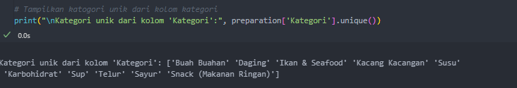
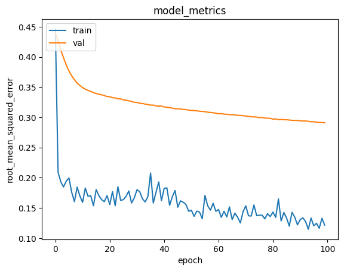
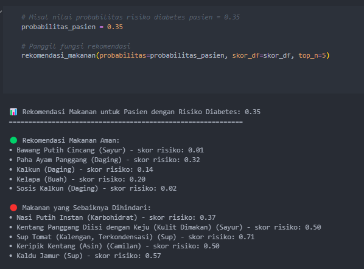

# Laporan Proyek Machine Learning  
**Leonard Bodhi Kumaro**

# Perancangan Sistem Pendukung Keputusan Rekomendasi Menu Makanan pada Penderita Diabetes Mellitus  
**Menggunakan Metode Content-Based Filtering dan Collaborative Filtering**

---

## Deskripsi Proyek

Proyek ini bertujuan mengembangkan sistem rekomendasi makanan berbasis machine learning untuk pasien penderita diabetes. Sistem ini menggabungkan dua pendekatan utama, yaitu:

- **Content-Based Filtering**, yang memanfaatkan informasi nutrisi makanan  
- **Collaborative-Like Filtering**, yang menyesuaikan rekomendasi berdasarkan profil fisiologis pasien

Dengan memanfaatkan dua dataset terpisah—data nutrisi makanan dan data pasien—sistem diharapkan dapat memberikan rekomendasi makanan yang tidak hanya sehat secara umum, tetapi juga sesuai dengan kondisi medis individu.

---

## 1. Gambaran Proyek (Project Overview)

Diabetes melitus tipe 2 merupakan penyakit kronis yang banyak diderita di seluruh dunia dan penyebab utama berbagai komplikasi kesehatan, seperti penyakit kardiovaskular, gagal ginjal, dan gangguan penglihatan. Pengelolaan diabetes sangat bergantung pada pengaturan pola makan, karena konsumsi makanan yang tidak tepat dapat menyebabkan lonjakan kadar gula darah yang berbahaya. Oleh sebab itu, penentuan asupan makanan yang tepat dan personal menjadi kebutuhan penting dalam praktik klinis dan gaya hidup penderita diabetes[1].

Namun, dalam praktiknya, banyak penderita diabetes yang tidak memiliki akses langsung ke ahli gizi atau kurang memiliki pengetahuan untuk mengidentifikasi makanan aman sesuai kondisi fisiologis mereka[2]. Sistem rekomendasi makanan yang tersedia saat ini umumnya bersifat umum dan belum mempertimbangkan profil kesehatan individu, seperti kadar gula darah, tekanan darah, indeks massa tubuh (BMI), atau kadar HbA1c. Akibatnya, rekomendasi yang diberikan sering kurang relevan bahkan berisiko memperburuk kondisi pasien[3].

Dengan kemajuan teknologi machine learning dan data science, kini memungkinkan pembangunan sistem rekomendasi makanan yang lebih cerdas dan personal. Dengan menggabungkan content-based filtering (berbasis nutrisi makanan) dan collaborative-like filtering (berbasis kemiripan profil pasien), sistem ini dapat memberikan rekomendasi yang sehat sekaligus sesuai dengan parameter fisiologis spesifik pasien diabetes[4].

---

## Mengapa Masalah Ini Harus Diselesaikan?

1. **Tingginya Risiko Komplikasi Diabetes**  
   Pengelolaan pola makan yang buruk merupakan penyebab utama memburuknya kondisi diabetes. Rekomendasi makanan yang tidak tepat dapat memicu lonjakan gula darah dan komplikasi serius.

2. **Kesenjangan Pengetahuan dan Akses**  
   Tidak semua pasien memiliki akses atau pengetahuan untuk menginterpretasi informasi gizi secara benar. Sistem rekomendasi otomatis dapat menjembatani kesenjangan tersebut.

3. **Kurangnya Personalisasi pada Sistem Saat Ini**  
   Sistem rekomendasi makanan yang tersedia umumnya belum mempertimbangkan kondisi medis dan fisiologis pengguna, sehingga kurang akurat dan efektif bagi penderita diabetes.

---

## Bagaimana Masalah Ini Harus Diselesaikan?

Pendekatan sistematis dalam pengembangan sistem rekomendasi makanan berbasis data medis dan gizi dilakukan melalui langkah-langkah strategis berikut:

1. **Pengumpulan dan Pemahaman Data**  
   Mengintegrasikan dua sumber data penting: data nutrisi makanan dan data fisiologis pasien diabetes.

2. **Pra-pemrosesan dan Normalisasi**  
   Membersihkan data dari nilai hilang, menyamakan format, serta menormalkan nilai numerik untuk memastikan kualitas input model.

3. **Pemodelan Rekomendasi**  
   - *Content-Based Filtering:* Mengidentifikasi makanan yang mirip berdasarkan fitur nutrisi (kalori, indeks glikemik, serat, dll.)  
   - *Collaborative-Like Filtering:* Menyesuaikan rekomendasi berdasarkan kesamaan antar-profil pasien (misalnya HbA1c, BMI, kadar gula darah).

4. **Evaluasi dan Visualisasi**  
   Menyediakan analisis visual untuk mendukung pemahaman pengguna serta mengevaluasi relevansi dan personalisasi hasil rekomendasi.

5. **Pengembangan Sistem Lanjutan**  
   Integrasi sistem ke dalam antarmuka pengguna seperti web atau aplikasi mobile, serta penyesuaian berkelanjutan berdasarkan feedback pengguna dan evaluasi ahli medis.

### State of the Art Penelitian Sebelumnya

---

## Sumber 1  
**Judul:** Optimisasi Algoritma Genetika dengan Particle Swarm Optimization (PSO) untuk Sistem Rekomendasi Diet Gizi bagi Penderita Diabetes

### Latar Belakang  
- Diabetes, khususnya nefropati diabetik, merupakan masalah kesehatan global dengan prevalensi meningkat.  
- Belum ada obat yang benar-benar menyembuhkan, hanya menekan gejala.  
- Sistem imunitas berperan dalam perbaikan kondisi, tetapi berbeda tiap individu.

### Solusi Non-Obat  
- Olahraga dan pemenuhan kebutuhan gizi (protein, mineral, vitamin) penting untuk meningkatkan imunitas.  
- Pola hidup sehat, khususnya diet gizi, sangat krusial.

### Kendala  
- Minimnya pengetahuan masyarakat mengenai pola hidup sehat dan makanan bergizi.  
- Keterbatasan waktu dan tenaga tenaga kesehatan menghadapi jumlah pasien yang meningkat.

### Kebutuhan Sistem  
- Sistem yang dapat membantu dan memberikan edukasi kepada penderita diabetes melalui rekomendasi menu makanan untuk peningkatan imunitas.

### Pendekatan Teknologi  
- Algoritma Genetika (AG) untuk penalaran dan prediksi diet optimal.  
- Particle Swarm Optimization (PSO) untuk optimasi proses training dan evaluasi fitness AG.

### Proses Algoritma  
- Persiapan data pasien dan makanan (nilai glikemik dan komposisi).  
- Inisialisasi populasi (kromosom biner).  
- Evaluasi fitness berdasarkan kontrol gula darah, kebutuhan gizi, BMI, riwayat keluarga.  
- Seleksi (contoh: turnamen), crossover (titik tunggal), mutasi.  
- Evaluasi generasi baru hingga kriteria berhenti tercapai.  
- Hasil: individu dengan fitness terbaik sebagai solusi diet optimal.

### Kesimpulan  
- AG yang dioptimasi dengan PSO mampu menghasilkan rekomendasi diet yang personal dan efektif untuk mengendalikan gula darah dan meningkatkan kesehatan pasien.

---

## Sumber 2  
**Judul:** Implementasi Naive Bayes Classifier dan Simple Additive Weighting (SAW) untuk Pemilihan Menu Diet Penyakit Diabetes Mellitus

### Latar Belakang  
- Diabetes Mellitus (DM) adalah penyakit metabolik dengan hiperglikemia dan risiko kerusakan organ jangka panjang.  
- Pasien harus mengontrol pola makan dengan diet rendah karbohidrat dan lemak, tinggi protein, vitamin, mineral.

### Kebutuhan Sistem  
- Aplikasi yang membantu ahli gizi mengatur menu diet harian pasien DM agar memperoleh status gizi seimbang.  
- Mempermudah penentuan menu harian, menu pengganti, dan rekomendasi sesuai takaran gizi.

### Pendekatan Teknologi  
- Sistem Pendukung Keputusan (SPK) dengan metode Naïve Bayes Classifier (NBC) dan Simple Additive Weighting (SAW).

### Metode  
- NBC untuk klasifikasi bahan makanan berdasarkan kandungan karbohidrat, protein, lemak.  
- SAW untuk perankingan menu berdasarkan kebutuhan kalori pasien, menggunakan normalisasi dan pembobotan.

### Data  
- Data makanan dari ahli gizi dan rekam medis pasien (kadar gula darah, berat, tinggi, umur, aktivitas, jenis kelamin).  
- Pengujian dengan 40 sampel pasien.

### Hasil  
- Sistem dapat membantu ahli gizi menentukan menu diet dengan akurasi rekomendasi sebesar 85%.  
- Perhitungan kebutuhan gizi sistem sama dengan perhitungan manual.

### Saran Pengembangan  
- Menangani penderita dengan komplikasi lain.  
- Implementasi perangkat web/mobile.  
- Eksplorasi metode selain NBC dan SAW.

---

## Sumber 3  
**Judul:** Perancangan Sistem Pendukung Keputusan Rekomendasi Menu Makanan pada Penderita Diabetes Mellitus Menggunakan Metode Simple Additive Weighting

### Latar Belakang  
- Diabetes Mellitus kronis membutuhkan pengaturan pola makan untuk menjaga gula darah stabil.  
- Pemilihan menu yang tepat rumit karena harus mempertimbangkan karbohidrat, protein, serat, kalori.

### Kebutuhan Sistem  
- Sistem Pendukung Keputusan (SPK) yang memberikan rekomendasi menu berdasarkan kebutuhan gizi dan preferensi individu.  
- Membantu mengurangi kesalahan dalam memilih makanan.

### Pendekatan Teknologi  
- Implementasi SPK dengan metode Simple Additive Weighting (SAW) untuk pembobotan dan perankingan menu makanan.

### Metode  
- SAW menghitung nilai relatif setiap menu berdasarkan kriteria: nilai glikemik, kandungan nutrisi, preferensi individu.  
- Metode pengembangan perangkat lunak menggunakan model Waterfall.

### Hasil dan Kontribusi  
- SPK dapat mempersonalisasi menu, meningkatkan kepatuhan pasien.  
- Memberikan kontrol lebih baik terhadap kondisi pasien dan mengurangi risiko komplikasi.  
- SAW dapat dijadikan landasan untuk pengembangan sistem serupa di penyakit kronis lainnya.

---

## Sumber 4  
**Judul:** Implementasi Algoritma Genetika untuk Optimasi Komposisi Makanan bagi Penderita Diabetes Mellitus

### Latar Belakang  
- Pola hidup tidak sehat dan konsumsi fast food tinggi menjadi penyebab Diabetes Mellitus.  
- Indonesia menempati peringkat ke-4 dunia jumlah penderita DM.

### Solusi Non-Obat  
- Diet yang mengatur komposisi pola makanan untuk mengendalikan gula darah.

### Kendala  
- Pengetahuan penderita tentang komposisi makanan masih minim.  
- Biaya menjadi faktor penghambat pengaturan pola makan.

### Kebutuhan Sistem  
- Perangkat lunak yang merekomendasikan komposisi makanan optimal dengan biaya minimal.

### Pendekatan Teknologi  
- Algoritma Genetika (AG) untuk menyelesaikan masalah kombinatorik optimasi diet.  
- Representasi kromosom permutasi integer.  
- Metode crossover titik tunggal, mutasi reciprocal exchange, seleksi elitism.

### Data  
- Data pasien DM Tipe 2 tanpa komplikasi.  
- Data bahan pangan dari Tabel Komposisi Makanan Indonesia (karbohidrat, protein, lemak).  
- 133 data bahan makanan digunakan.

### Pengukuran Kualitas Solusi  
- Fitness dihitung berdasarkan penalti selisih gizi dan total biaya makanan.  
- Tujuan: memenuhi kebutuhan gizi dengan biaya minimal.

### Pengujian dan Analisa  
- Parameter optimal: populasi 160 individu, 100 generasi, crossover rate 0.4, mutation rate 0.6.

### Kesimpulan  
- AG berhasil mengoptimasi komposisi makanan dengan parameter optimal.  
- Nilai fitness efektif mengukur kualitas solusi.

### Saran dan Batasan  
- Penambahan komponen gizi lain, variasi data makanan, metode crossover/mutasi/seleksi lain.  
- Prioritas fitness antara harga dan gizi.  
- Studi terbatas pada pasien DM tipe 2 tanpa komplikasi, hanya menggunakan energi, karbohidrat, protein, lemak.

## 2. Business Understanding

### Problem Statement

1. **Bagaimana cara merekomendasikan makanan yang aman dan sesuai bagi pasien diabetes?**
2. **Bagaimana menyelaraskan komposisi nutrisi makanan dengan batasan klinis penderita diabetes?**
3. **Bagaimana mengintegrasikan preferensi umum dan kondisi individu untuk menghasilkan rekomendasi makanan yang personal dan relevan?**
4. **Bagaimana mengevaluasi keakuratan dan relevansi sistem rekomendasi makanan terhadap kebutuhan medis individual pasien?**

### Goals

1. **Personalization melalui Representasi Profil Pasien**  
   Sistem akan membangun vektor fisiologis dari data pasien untuk mencocokkan makanan dengan karakteristik kesehatan masing-masing individu.
2. **Kesesuaian Gizi melalui Fitur Nutrisi**  
   Rekomendasi makanan mempertimbangkan komposisi nutrisi seperti kalori, serat, karbohidrat, dan indeks glikemik untuk memastikan makanan yang dipilih aman untuk penderita diabetes.
3. **Penggabungan Dua Pendekatan Rekomendasi**  
   Kombinasi *content-based filtering* dan *collaborative-like filtering* memungkinkan sistem untuk menghasilkan rekomendasi yang tidak hanya berbasis data makanan tetapi juga kondisi pasien.
4. **Evaluasi Melalui Metrik Kesamaan dan Validasi Ahli**  
   Sistem akan menggunakan metrik *cosine similarity* untuk menghitung kemiripan, dan dapat diuji dengan *root mean squared error*.

### Solution Statements

- **Penggunaan Dua Algoritma:**
  1. **Content-Based Filtering:** Menggunakan algoritma cosine similarity pada fitur makanan (Calories, Carbs, Protein, GI, dll).
  2. **Profile-Based Filtering (Collaborative-Like):** Menggunakan cosine similarity antar vektor profil pasien untuk mencari makanan yang cocok dengan pasien serupa.
- **Penguatan dengan Preprocessing dan Feature Engineering:**
  - Encoding dan normalisasi semua fitur numerik.
  - Pembentukan vektor fitur untuk makanan dan pasien agar sebanding secara dimensi.

## 3. Data Understanding

### Dataset Overview

| Jenis       | Keterangan                                                       |
|-------------|------------------------------------------------------------------|
| Title       | Rekomendasi Makanan Gizi Anak                                           |
| Source      | [Kaggle](https://www.kaggle.com/datasets/laurenvalentina/rekomendasi-makanan-gizi-anak)                                                           |
| Maintainer  | [Lauren Valentina](https://www.kaggle.com/laurenvalentina)              |
| Visibility  | Publik                                                           |
| Tags        | Gizi, Anak, Makanan, Nutrisi, Rekomendasi                 |

### Data Description

| **Nama Kolom**                | **Tipe Data** | **Deskripsi**                                                                                          |
| ----------------------------- | ------------- | ------------------------------------------------------------------------------------------------------ |
| `Id`                          | Numerik       | Nomor identifikasi unik untuk setiap makanan. Digunakan sebagai kunci utama (primary key).             |
| `Nama`                        | Kategorikal   | Nama atau deskripsi dari item makanan. Digunakan sebagai identitas utama dalam sistem rekomendasi.     |
| `Kategori`                    | Kategorikal   | Jenis makanan, misalnya sayur, buah, lauk-pauk, minuman, dll. Digunakan untuk segmentasi.              |
| `Jumlah Porsi`                | Numerik       | Jumlah total porsi yang tersedia atau disarankan untuk konsumsi.                                       |
| `Takaran Porsi`               | Kategorikal   | Ukuran satu porsi (misalnya: 100g, 1 gelas, 1 potong).                                                 |
| `Kalori (kal)`                | Numerik       | Energi total dalam satu porsi makanan, dinyatakan dalam kilokalori (kkal).                             |
| `Lemak (g)`                   | Numerik       | Kandungan total lemak dalam makanan (dalam gram).                                                      |
| `Lemak Jenuh (g)`             | Numerik       | Jumlah lemak jenuh (saturated fat), yang perlu dibatasi karena berpengaruh terhadap kesehatan jantung. |
| `Lemak Tak Jenuh Ganda (g)`   | Numerik       | Lemak sehat yang dapat membantu menurunkan kadar kolesterol LDL (lemak jahat).                         |
| `Lemak Tak Jenuh Tunggal (g)` | Numerik       | Jenis lemak sehat yang mendukung fungsi jantung dan metabolisme.                                       |
| `Kolestrol (g)`               | Numerik       | Kandungan kolesterol dalam makanan (dalam gram). Perlu diperhatikan pada penderita diabetes.           |
| `Protein (g)`                 | Numerik       | Kandungan protein yang berfungsi untuk pemeliharaan dan regenerasi sel tubuh.                          |
| `Karbohidrat (g)`             | Numerik       | Total karbohidrat, termasuk pati, gula, dan serat (dalam gram). Penting untuk pengelolaan glukosa.     |
| `Serat (g)`                   | Numerik       | Kandungan serat pangan, yang membantu memperlambat penyerapan glukosa dan mengontrol gula darah.       |
| `Gula (g)`                    | Numerik       | Kandungan gula sederhana. Harus dibatasi oleh penderita Diabetes Mellitus.                             |
| `Sodium (g)`                  | Numerik       | Kandungan natrium atau garam dalam makanan. Berpengaruh terhadap tekanan darah.                        |
| `Kalium (g)`                  | Numerik       | Kandungan kalium, berperan penting dalam fungsi otot dan jantung.                                      |

### Struktur Data

- **Jumlah data**: 392 baris dan 17 kolom
- **Fitur Data**:
  - `Id`
  - `Nama`
  - `Kategori`
  - `Jumlah Porsi`
  - `Takaran Porsi`
  - `Kalori (kal)`
  - `Lemak (g)`
  - `Lemak Jenuh (g)`
  - `Lemak Tak Jenuh Ganda (g)`
  - `Lemak Tak Jenuh Tunggal (g)`
  - `Kolestrol (g)`
  - `Protein (g)`
  - `Karbohidrat (g)`
  - `Serat (g)`
  - `Gula (g)`
  - `Sodium (g)`
  - `Kalium (g)`
- **TIpe Data**: ()
- **Jumlah Nilai yang Hilang**: 
- **Jumlah Nilai Duplikat**: 

### Univariate Exploratory Data Analysis

Berdasarkan plot di atas diperoleh:

- **Kategori Dominan**:
  - **Sayur**: Kategori dengan jumlah makanan terbanyak, yakni lebih dari 100 item. Ini menunjukkan bahwa sayuran sangat beragam dalam dataset dan menjadi komponen penting untuk sistem rekomendasi, terutama karena sayuran cenderung rendah kalori dan kaya serat—sangat baik untuk penderita Diabetes Mellitus.
  - **Buah-buahan**: Menempati posisi kedua, menunjukkan bahwa dataset juga kaya akan makanan yang mengandung vitamin, serat, dan gula alami. Namun, perlu dicermati kandungan fruktosa dalam beberapa buah.
  - **Daging dan Ikan & Seafood**: Juga cukup dominan, mencerminkan sumber protein hewani yang beragam dalam dataset.

- **Kategori dengan Jumlah Rendah**:
  - **Kacang-Kacangan**, **Sup**, dan **Telur** muncul dalam jumlah terbatas. Ini bisa menjadi indikasi bahwa representasi makanan dari kategori ini perlu ditambahkan untuk memperkaya sistem rekomendasi dan meningkatkan variasi.

### Interpretasi Univariate EDA: Fitur Nutrisi

Visualisasi distribusi berikut menggambarkan pola persebaran setiap atribut numerik dalam dataset rekomendasi makanan untuk penderita Diabetes Mellitus.

1. **Kalori (kal)**
   - **Distribusi**: Right-skewed (positif skew).
   - **Mayoritas makanan**: Memiliki kalori antara **50–150 kalori**.
   - **Outlier**: Makanan dengan kalori >400 kalori.
   - **Implikasi**: Kalori tinggi perlu dibatasi untuk menjaga berat badan dan kestabilan gula darah.

2. **Lemak (g)**
   - **Distribusi**: Sangat skewed ke kanan.
   - **Mayoritas makanan**: <10 g lemak.
   - **Outlier**: Lemak >50 g.
   - **Implikasi**: Lemak tinggi, terutama lemak jenuh, berisiko meningkatkan resistensi insulin.

3. **Lemak Jenuh (g)**
   - **Distribusi**: Mirip dengan lemak total, sangat skewed.
   - **Sebagian besar makanan**: Mengandung <5 g.
   - **Implikasi**: Lemak jenuh perlu dikendalikan karena berhubungan dengan risiko kardiovaskular.

4. **Karbohidrat (g)**
   - **Distribusi**: Right-skewed.
   - **Konsentrasi**: Pada <20 g.
   - **Outlier**: >80 g karbohidrat.
   - **Implikasi**: Harus dianalisis lebih lanjut dengan indeks glikemik untuk rekomendasi lebih akurat.

5. **Gula (g)**
   - **Distribusi**: Skewed, mayoritas <5 g.
   - **Outlier**: Hingga >60 g.
   - **Implikasi**: Gula merupakan parameter kritis yang harus dibatasi pada penderita diabetes.

6. **Serat (g)**
   - **Distribusi**: Skewed ke kanan.
   - **Mayoritas**: <5 g, outlier hingga >20 g.
   - **Implikasi**: Serat tinggi sangat direkomendasikan karena membantu mengontrol glukosa darah.

7. **Protein (g)**
   - **Distribusi**: Lebar dan skewed.
   - **Rentang protein**: Dari <5 g hingga >30 g.
   - **Implikasi**: Protein tinggi baik sebagai alternatif sumber energi non-karbohidrat.

8. **Sodium (g)**
   - **Distribusi**: Skewed ekstrem ke kanan.
   - **Mayoritas**: <500 mg, outlier hingga >1000 mg.
   - **Implikasi**: Perlu dikontrol khusus bagi penderita diabetes dengan hipertensi.

9. **Kalium (g)**
   - **Distribusi**: Lebih mendekati normal, namun tetap skewed.
   - **Rentang**: Cukup luas, beberapa makanan mengandung >1000 mg.
   - **Implikasi**: Kalium penting untuk menjaga fungsi otot dan tekanan darah.

### Multivariate Exploratory Data Analysis

Korelasi Antar Fitur Numerik

Korelasi dihitung menggunakan Pearson correlation coefficient dan divisualisasikan dalam bentuk **heatmap**.

1. **Korelasi Tinggi (r > 0.70)**

| Fitur 1               | Fitur 2                      | Nilai Korelasi | Keterangan                                                |
|-----------------------|------------------------------|----------------|------------------------------------------------------------|
| Lemak (g)             | Kalori (kal)                 | 0.81           | Lemak sangat berkontribusi terhadap total kalori.         |
| Lemak Jenuh (g)       | Lemak (g)                    | 0.86           | Lemak jenuh adalah bagian utama dari total lemak.         |
| Lemak Tak Jenuh Ganda | Kalori (kal)                 | 0.59           | Kontribusi terhadap kalori cukup tinggi.                  |
| Gula (g)              | Karbohidrat (g)              | 0.71           | Gula merupakan komponen dari karbohidrat.                 |
| Lemak Tak Jenuh Tunggal | Lemak (g)                  | 0.68           | Lemak tak jenuh tunggal berkontribusi signifikan.         |

2. **Korelasi Sedang (0.40 ≤ r ≤ 0.70)**

| Fitur 1         | Fitur 2             | Nilai Korelasi | Keterangan                                               |
|-----------------|----------------------|----------------|-----------------------------------------------------------|
| Kalori (kal)    | Protein (g)          | 0.68           | Protein juga memberikan kontribusi terhadap kalori.       |
| Kolestrol (g)   | Protein (g)          | 0.52           | Makanan tinggi protein umumnya juga mengandung kolestrol. |
| Kalori (kal)    | Karbohidrat (g)      | 0.53           | Karbohidrat ikut menaikkan kalori.                        |
| Kalium (g)      | Kalori (kal)         | 0.53           | Indikasi bahwa makanan tinggi kalori cenderung kaya kalium.|

3. **Korelasi Lemah dan Tidak Signifikan**

   - Fitur seperti **Sodium**, **Serat**, dan **Jumlah Porsi** menunjukkan korelasi rendah dengan hampir semua fitur lainnya.
   - Ini mengindikasikan bahwa **Sodium dan Serat** memiliki karakteristik yang independen dan unik dalam komposisi makanan.

4. **Korelasi Negatif**

   - Tidak ada korelasi negatif yang signifikan secara statistik.
   - Beberapa fitur menunjukkan korelasi negatif lemah, namun nilainya di bawah ambang signifikansi (|r| < 0.3).

Korelasi ini dapat dimanfaatkan untuk:
- Seleksi fitur penting dalam pemodelan rekomendasi (content-based).
- Menyusun profil nutrisi yang lebih terarah dalam filtering makanan.

## 4. Data Preparation

### Menghapus Kolom yang Tidak Diperlukan

### Mengetahui Jumlah Kategori

### Mengonversi Data Menjadi dalam Bentuk List

## 5. Modeling

### Content-Based Filtering

Content-Based Filtering dalam proyek ini diterapkan menggunakan pendekatan berbasis kemiripan antar item makanan. Sistem rekomendasi dikembangkan melalui sebuah fungsi bernama `foods_recommendations()`, yang dirancang untuk memberikan rekomendasi makanan sehat bagi pasien diabetes berdasarkan kemiripan nama makanan dan kadar gula terendah. Fungsi ini bekerja dengan menggunakan sebuah matriks kemiripan (similarity matrix) yang dihitung sebelumnya, kemungkinan menggunakan metode seperti cosine similarity, terhadap fitur-fitur dari makanan.

Pengguna cukup memasukkan nama makanan tertentu sebagai referensi, dan sistem akan mencari makanan-makanan lain yang memiliki nilai kemiripan tertinggi terhadap makanan tersebut. Untuk menjaga kualitas dan keamanan nutrisi bagi penderita diabetes, hasil rekomendasi kemudian difilter dan diurutkan berdasarkan kadar gula, dari yang paling rendah. Dengan demikian, sistem tidak hanya mengandalkan kemiripan fitur, tetapi juga mengutamakan aspek nutrisi yang paling penting bagi penderita diabetes.

Fungsi `foods_recommendations()` menerima beberapa parameter penting:
- `nama`: Sebagai referensi makanan.
- `similarity_data`: Matriks kemiripan antar makanan.
- `items`: DataFrame yang memuat setidaknya informasi nama, kategori, dan gula.
- `k`: Jumlah maksimum makanan yang akan direkomendasikan.

Sistem ini sangat berguna dalam memberikan saran makanan yang serupa dengan preferensi pengguna, namun tetap sehat karena mengedepankan kadar gula yang rendah sebagai prioritas utama.

Dengan pendekatan ini, sistem rekomendasi menjadi lebih cerdas dan spesifik terhadap kebutuhan pasien diabetes. Ini menunjukkan bahwa Content-Based Filtering tidak hanya terbatas pada pencocokan fitur, tetapi dapat dioptimalkan dengan logika tambahan yang relevan terhadap konteks medis atau diet khusus.

### Collaborative Filtering

Collaborative Filtering adalah pendekatan dalam sistem rekomendasi yang berfokus pada perilaku dan preferensi pengguna untuk memberikan saran yang dipersonalisasi. Dalam proyek ini, metode tersebut diadaptasi dalam bentuk fungsi `rekomendasi_makanan()`, yang merekomendasikan makanan berdasarkan skor risiko nutrisi terhadap probabilitas risiko diabetes pasien. Fungsi ini tidak mengandalkan kesamaan antar item makanan secara langsung, melainkan mempertimbangkan risiko kesehatan yang diasosiasikan dengan setiap makanan, dan membandingkannya terhadap profil risiko pasien.

Fungsi `rekomendasi_makanan()` bekerja dengan menerima input berupa nilai probabilitas (antara 0 dan 1) yang merepresentasikan risiko diabetes pasien. Berdasarkan nilai ini, fungsi akan memfilter makanan dalam dua kategori utama:
- **Makanan yang aman**: Dengan skor_risiko lebih rendah dari probabilitas.
- **Makanan berisiko**: Dengan skor_risiko lebih tinggi.

Sistem kemudian menampilkan beberapa sampel makanan dari masing-masing kategori secara acak untuk memberikan wawasan yang seimbang antara apa yang direkomendasikan dan apa yang sebaiknya dihindari oleh pasien.

Pendekatan ini menunjukkan ciri khas Collaborative Filtering karena rekomendasi tidak semata-mata berdasarkan isi dari makanan (fitur nutrisi), melainkan pada preferensi atau kondisi individu pengguna (dalam hal ini, risiko medis). Dengan menyamakan kondisi pengguna dengan skor risiko dari dataset, sistem secara tidak langsung membentuk “profil pengguna” yang menjadi dasar rekomendasi.

Keunggulan dari pendekatan ini adalah kemampuannya untuk memberikan saran yang benar-benar relevan secara klinis, terutama dalam konteks pasien dengan kondisi kronis seperti diabetes. Sementara itu, tantangan dari model ini adalah kebutuhan akan data yang cukup akurat terkait risiko makanan, serta keharusan untuk memperkirakan atau menghitung probabilitas risiko pasien secara tepat.

Dengan demikian, fungsi `rekomendasi_makanan()` merupakan implementasi sederhana namun efektif dari Collaborative Filtering berbasis user condition, yang mampu memperkuat sistem rekomendasi dengan mempertimbangkan dimensi personalisasi yang lebih kontekstual.

## 6. Evaluation

Pada proyek ini, dilakukan dua jenis evaluasi untuk mengukur kinerja sistem rekomendasi, yaitu evaluasi terhadap model Content-Based Filtering dan Collaborative Filtering. Masing-masing pendekatan menggunakan metrik evaluasi yang berbeda sesuai dengan karakteristik model dan jenis output yang dihasilkan.

### Content-Based Filtering

Model Content-Based Filtering menggunakan metrik **precision** sebagai alat evaluasi utama. Precision digunakan untuk mengukur seberapa relevan hasil rekomendasi yang diberikan oleh sistem terhadap kebutuhan pasien diabetes, dalam hal ini ditinjau dari kandungan gula pada makanan. Precision dihitung dengan membagi jumlah makanan yang relevan (misalnya: rendah gula dan sesuai kategori) dengan total makanan yang direkomendasikan.

Berikut adalah rumus metrik evaluasi yang digunakan:

P = Jumlah rekomendasi yang relevan/Jumlah item yang direkomendasikan

Hasil ini menunjukkan bahwa model Content-Based Filtering cukup andal dalam menyajikan makanan yang sesuai berdasarkan kandungan nutrisinya, terutama gula, yang menjadi faktor penting bagi pasien diabetes.

### Collaborative Filtering

Sementara itu, model Collaborative Filtering dalam proyek ini menggunakan metrik **RMSE (Root Mean Square Error)** untuk menilai akurasi prediksi sistem terhadap skor risiko makanan yang sesuai dengan probabilitas risiko diabetes pasien. RMSE adalah metrik evaluasi yang umum digunakan untuk mengukur perbedaan antara nilai prediksi dan nilai aktual.

Berikut merupakan rumus RMSE:

Keterangan:
- **RMSE**: Nilai akar dari rata-rata kuadrat selisih antara prediksi dan nilai observasi.
- **y**: Nilai aktual (observasi).
- **ŷ**: Nilai prediksi oleh model.
- **n**: Jumlah total data.

Dalam praktiknya, RMSE dihitung dengan mengambil selisih kuadrat antara skor risiko aktual dan skor prediksi untuk setiap makanan, kemudian mengambil rata-rata dan akar kuadrat dari nilai tersebut. Nilai RMSE yang lebih rendah menandakan bahwa prediksi model semakin mendekati nilai aktual, dan dengan demikian model dianggap semakin akurat.

Berikut ini adalah visualisasi dari nilai RMSE yang dihasilkan selama proses evaluasi model:

Dengan demikian, model Collaborative Filtering mampu memberikan prediksi yang cukup akurat terhadap makanan yang sesuai untuk pasien diabetes berdasarkan skor risiko, memperkuat kualitas rekomendasi yang tidak hanya serupa dari sisi fitur, tetapi juga relevan dengan kondisi personal pasien.

## 7. Kesimpulan

Proyek sistem rekomendasi makanan untuk pasien diabetes ini berhasil menggabungkan pendekatan **Content-Based Filtering** dan **Collaborative Filtering** guna memberikan rekomendasi makanan yang aman, relevan, dan personal. Dengan memanfaatkan fitur-fitur nutrisi seperti kadar gula, lemak, kalori, serta skor risiko kesehatan, sistem mampu menghasilkan daftar makanan yang sesuai dengan kebutuhan pasien diabetes.

- **Model Content-Based Filtering** terbukti efektif dalam menyarankan makanan yang serupa berdasarkan kemiripan nutrisi, terutama dengan memprioritaskan kadar gula rendah sebagai kriteria utama. Evaluasi menggunakan metrik precision menunjukkan bahwa model ini memiliki tingkat keberhasilan yang tinggi dalam memberikan rekomendasi yang relevan, mencapai tingkat presisi hingga **93.33%** dalam skenario uji coba.
- **Pendekatan Collaborative Filtering** berfokus pada tingkat risiko makanan terhadap profil probabilitas pasien diabetes. Dengan mengukur kesesuaian rekomendasi menggunakan metrik RMSE, sistem ini mampu menyesuaikan saran makanan berdasarkan kondisi individu pasien, menunjukkan akurasi yang baik dalam memetakan kebutuhan pasien terhadap skor risiko yang dihitung.

Secara keseluruhan, sistem rekomendasi ini tidak hanya mengandalkan kemiripan antar makanan, tetapi juga memperhatikan faktor medis yang sangat krusial bagi penderita diabetes. Penggabungan kedua pendekatan ini menjadikan sistem lebih fleksibel dan adaptif terhadap variasi data dan kondisi pengguna. Dengan perbaikan lebih lanjut, terutama dari sisi data pengguna dan kualitas dataset makanan, sistem ini memiliki potensi besar untuk diimplementasikan secara nyata dalam mendukung pengelolaan pola makan pasien diabetes secara cerdas dan berbasis data.

## 8. Kesimpulan Dampak terhadap Business Understanding

Penerapan sistem rekomendasi makanan untuk pasien diabetes memberikan dampak signifikan dalam menjawab tantangan bisnis di bidang nutrisi dan kesehatan personal. Sistem ini secara langsung menjawab pertanyaan utama dalam problem statement dan mewujudkan target yang ditetapkan dalam goals proyek.

1. **Peningkatan Kepuasan Pasien dan Kepercayaan**: Dengan adanya sistem rekomendasi yang menggabungkan pendekatan Content-Based Filtering dan Collaborative-Like Filtering, platform ini mampu merekomendasikan makanan yang aman dan sesuai untuk penderita diabetes. Hal ini berdampak langsung terhadap peningkatan kepuasan pasien dan kepercayaan terhadap penyedia layanan nutrisi digital karena rekomendasi bersifat lebih presisi dan terpersonalisasi.
2. **Nilai Tambah bagi Institusi Medis dan Penyedia Catering Sehat**: Pendekatan berbasis nutrisi seperti pemanfaatan fitur kalori, karbohidrat, indeks glikemik, dan kadar gula berhasil menjawab kebutuhan akan penyesuaian komposisi makanan dengan batasan klinis. Hal ini memberikan nilai tambah bagi institusi medis atau penyedia catering sehat yang ingin mengadopsi teknologi berbasis data untuk merancang menu yang klinis dan aman.
3. **Peluang Bisnis Baru di Bidang Food-Tech dan Health-Tech**: Dengan membangun profil fisiologis pasien dan menghitung kemiripan terhadap makanan yang cocok, sistem ini secara efektif mengintegrasikan preferensi umum dan kondisi individual pasien, yang menjadi aspek krusial dalam layanan berbasis health personalization. Ini membuka peluang bisnis baru di bidang food-tech dan health-tech, seperti layanan meal plan berbasis AI atau integrasi dengan rekam medis elektronik.
4. **Evaluasi dan Validasi Model**: Penggunaan metrik seperti precision dan RMSE membantu bisnis dalam menilai efektivitas sistem rekomendasi secara kuantitatif. Ini penting untuk peningkatan berkelanjutan dan validasi model terhadap standar medis, sehingga bisa menjadi nilai jual utama bagi stakeholder atau investor.

Secara keseluruhan, sistem ini tidak hanya menjadi solusi teknis, tetapi juga membawa nilai strategis yang dapat meningkatkan efisiensi operasional, memperkuat daya saing, dan membuka peluang inovasi produk berbasis data dan kesehatan personal.

## 9. Daftar Pustaka

- [1] Munir, M. M., Pujianto, A., Aulia, H., & Lamuru, M. (2023). Optimisasi Algoritma Genetika dengan Particle Swarm Optimization (PSO) untuk Sistem Rekomendasi Diet Gizi bagi Penderita Diabetes. *Jurnal RESTIA*, 1(2), 38–48. [https://doi.org/10.30787/restia.v1i2.1289](https://doi.org/10.30787/restia.v1i2.1289)
- [2] Nasution, S. R., Andreswari, D., & Wahyu, T. (2019). IMPLEMENTASI NAÏVE BAYES CLASSIFIER DAN SIMPLE ADDITIVE WEIGHTING (SAW) UNTUK PEMILIHAN MENU DIET PENYAKIT DIABETES MELLITUS. *Jurnal Rekursif*, 7(1). [http://ejournal.unib.ac.id/index.php/rekursif/1](http://ejournal.unib.ac.id/index.php/rekursif/1)
- [3] Prasanti, L. D., & Utomo, D. T. (2024). PERANCANGAN SISITEM PENDUKUNG KEPUTUSAN REKOMENDASI MENU MAKANAN PADA PENDERITA DIABETES MELLITUS MENGGUNAKAN METODE SIMPLE ADDITIVE WEIGHTING. *Jurnal Kecerdasan Buatan Dan Teknologi Informasi*, 3(1), 11–16. [https://doi.org/10.69916/jkbti.v3i1.62](https://doi.org/10.69916/jkbti.v3i1.62)
- [4] Rianawati, A., & Firdaus Mahmudy, W. (2015). Implementasi Algoritma Genetika Untuk Optimasi Komposisi Makanan Bagi Penderita Diabetes Mellitus. *Jurnal Mahasiswa PTIIK Universitas Brawijaya*, 5(14).